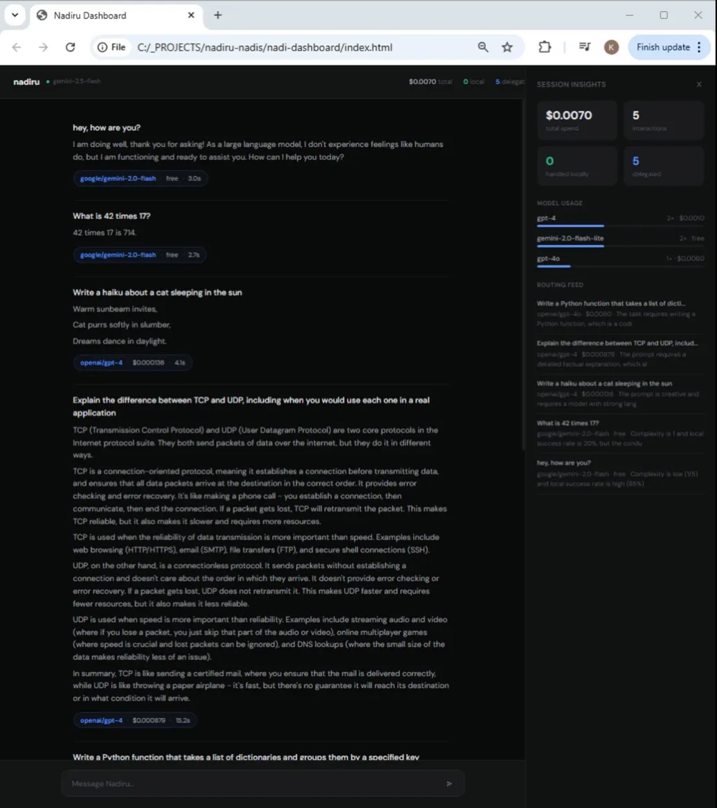

# Nadiru Engine

### Opening

**Sovereign AI orchestration engine with a learning Conductor.**



*Intelligent routing in action: simple questions route to efficient models, complex tasks delegate to quality providers — with full visibility in the dashboard.*

## Why Nadiru?

**Not just another API proxy.** The Conductor learns *your* patterns: it classifies every request, routes based on priority and history, logs outcomes, and tightens decisions over time. **LiteLLM** and similar tools focus on **API compatibility** — swapping backends behind one interface. **OpenRouter** is a **model marketplace** with a unified API. Nadiru is different: it is a **routing brain with memory** — implicit feedback, cold-start protection, refusal handling, and a community model registry — so delegation gets smarter the longer you run it.

- **Delegate-first:** starts smart, gets smarter over time.
- **Provider-agnostic:** works with local models or cloud APIs.
- **Dynamic model discovery:** no hardcoded lists in core routing.

## Features

- Provider-agnostic Conductor (Ollama, Gemini, Claude, or any configured model)
- Dynamic model discovery (130+ models found automatically, depending on keys)
- Response streaming with SSE (`POST /generate/stream`)
- Refusal detection and automatic retry
- Implicit feedback learning
- Cold start protection (delegate-first)
- 15+ provider adapters including generic OpenAI-compatible
- Web dashboard with live routing visualization ([nadiru-nadis](https://github.com/hlk-devs/nadiru-nadis))
- Direct provider health testing (`POST /test-provider`)
- Community-maintainable model registry (`model_registry.json`)
- MIT licensed, 34 tests, CI pipeline

## Three Conductor Tiers

| Tier | Conductor | Notes |
|------|-----------|--------|
| **1 — Cloud** | e.g. Gemini Flash, Claude Haiku | Best routing JSON, **no GPU** |
| **2 — Beefy local** | e.g. 70B on Ollama | Good routing, full privacy |
| **3 — Small local** | e.g. 8–14B | Needs cold-start training period (delegate-first) |

## Quick Start

1. Install **Ollama** *or* choose a **cloud Conductor** (set `CONDUCTOR_PROVIDER` and API key).
2. Clone: `git clone https://github.com/hlk-devs/nadiru-engine.git && cd nadiru-engine`
3. Copy `.env.example` to `.env` and add your API keys.
4. `pip install -r requirements.txt`
5. `python -m nadiru_engine`
6. Open the **dashboard** from [nadiru-nadis](https://github.com/hlk-devs/nadiru-nadis) (`nadi-dashboard/index.html` or serve it) pointed at the engine.

## API Contract

| Method | Path | Purpose |
|--------|------|---------|
| `POST` | `/connect` | Register a Nadi; returns `nadi_id` |
| `POST` | `/generate` | Full response in one JSON body |
| `GET` | `/query` | Paginated interaction history |
| `POST` | `/generate/stream` | SSE: routing event, token chunks, `done` |
| `GET` | `/providers` | Configured providers and model lists |
| `POST` | `/test-provider` | Direct provider health check |
| `GET` | `/health` | Engine and conductor status |

## Building a Nadi

A **Nadi** is any client that talks to the engine: CLI, web app, automation, IDE plugin. Register once, then send prompts under that `nadi_id` so interactions are logged and learning applies.

```python
import httpx

ENGINE = "http://localhost:8765"

r = httpx.post(f"{ENGINE}/connect", json={"name": "my-nadi", "default_priority": "balanced"})
nadi_id = r.json()["nadi_id"]

r = httpx.post(f"{ENGINE}/generate", json={
    "nadi_id": nadi_id,
    "prompt": "Explain quantum entanglement simply",
})
print(r.json()["content"])

r = httpx.get(f"{ENGINE}/query", params={"nadi_id": nadi_id, "limit": 10})
print(r.json()["total"])
```

See **[nadiru-nadis](https://github.com/hlk-devs/nadiru-nadis)** for six example Nadis: web dashboard, CLI chat, cost reporting, health monitoring, translation, and summarization.

## Supported Providers

| Provider | Adapter | Auth env var |
|----------|---------|--------------|
| Ollama | `OllamaProvider` | (local; optional `LOCAL_MODEL_URL` / `OLLAMA_BASE_URL`) |
| Anthropic | `AnthropicProvider` | `ANTHROPIC_API_KEY` |
| OpenAI | `OpenAIProvider` | `OPENAI_API_KEY` |
| Google | `GoogleProvider` | `GOOGLE_API_KEY` |
| Groq | `GroqProvider` | `GROQ_API_KEY` |
| DeepSeek | `DeepSeekProvider` | `DEEPSEEK_API_KEY` |
| Together | `TogetherProvider` | `TOGETHER_API_KEY` |
| Perplexity | `PerplexityProvider` | `PERPLEXITY_API_KEY` |
| Cerebras | `CerebrasProvider` | `CEREBRAS_API_KEY` |
| OpenRouter | `OpenAICompatibleProvider` | `OPENROUTER_API_KEY` |
| Mistral | `OpenAICompatibleProvider` | `MISTRAL_API_KEY` |
| Fireworks | `OpenAICompatibleProvider` | `FIREWORKS_API_KEY` |
| AI21 | `OpenAICompatibleProvider` | `AI21_API_KEY` |
| Cohere | `OpenAICompatibleProvider` | `COHERE_API_KEY` |
| Azure OpenAI | `OpenAICompatibleProvider` | `AZURE_OPENAI_API_KEY`, `AZURE_OPENAI_ENDPOINT` |

Any OpenAI-compatible API works: add an env var and a `PROVIDER_MAP` entry in `registry.py`.

## Project Structure

```text
nadiru-engine/
├── README.md
├── CHANGELOG.md
├── CONTRIBUTING.md
├── LICENSE
├── pyproject.toml
├── requirements.txt
├── .env.example
├── docs/
│   ├── CONDUCTOR_DESIGN.md
│   └── images/
│       └── dashboard.png
├── community-nadis/
│   └── README.md
├── nadiru_engine/
│   ├── __main__.py
│   ├── service.py
│   ├── conductor.py
│   ├── memory.py
│   ├── model_catalog.py
│   ├── model_registry.json
│   └── providers/
│       ├── base.py
│       ├── registry.py
│       ├── ollama_provider.py
│       ├── openai_compatible_provider.py
│       └── …
└── tests/
```

## Roadmap

- [x] Response streaming (v0.1.1)
- [x] Refusal detection and retry (v0.1.1)
- [x] Generic OpenAI-compatible provider (v0.1.1)
- [x] Direct provider health testing (v0.1.1)
- [ ] Configurable routing prompts (v0.2.0)
- [ ] Periodic model re-discovery (v0.2.0)
- [ ] Nadi SDK Python package (v0.3.0)
- [ ] Pipeline / multi-step Nadi support (v0.3.0)

## Philosophy

The engine stays small: routing, memory, providers, and API. Domain logic lives in Nadis.

*From the deepest point flows the purest intelligence.*

## License

MIT — [HLK Devs](https://github.com/hlk-devs).

